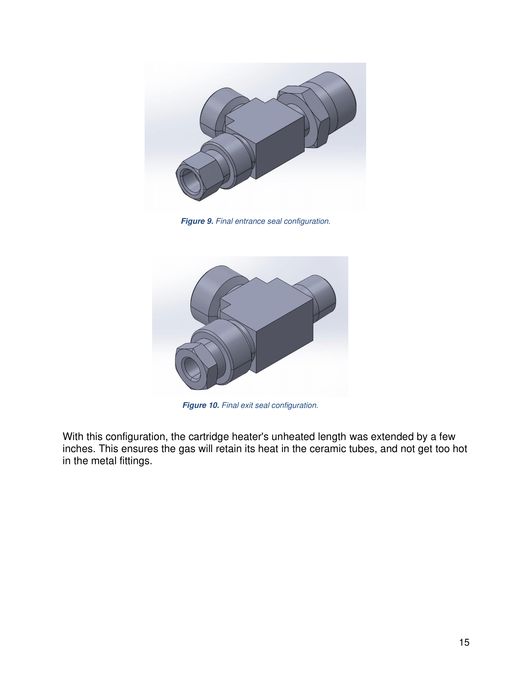
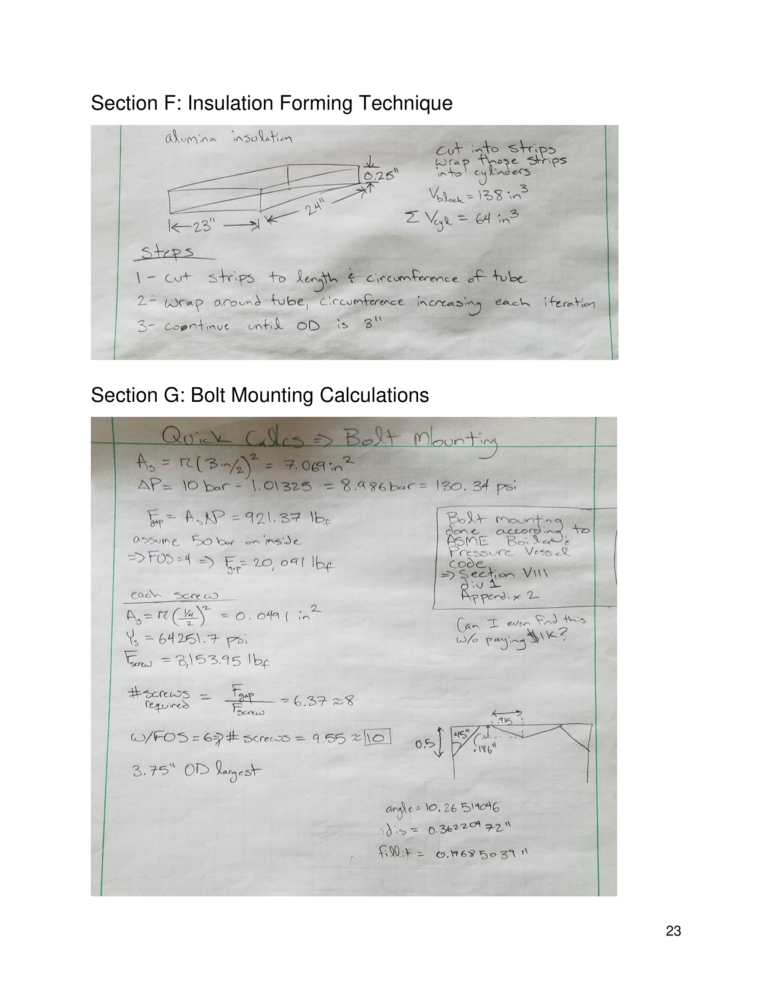

# High Pressure Manifold

Development of a high pressure manifold to house a miniature VYSZion battery cell at the center. Operable to temperatures of 650-800°C and pressures of 10 bar. Contains two inlets and outlets, one each for gas and  air, and allow for insertion of temperature probes, pressure sensors, and electrical wires.

## Research Paper

